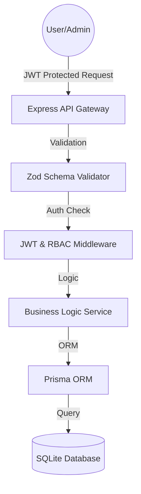
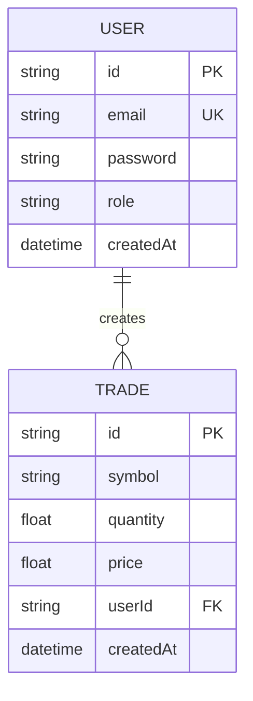

# 📈 PrimeTrade AI - Asset Intelligence Platform

[](https://nodejs.org/)
[](https://www.prisma.io/)
[](https://nextjs.org/)
[](#-api-documentation)

PrimeTrade AI is a production-grade **Asset & Trade Management System** designed for the Web3 space. It demonstrates a high-fidelity implementation of secure RESTful APIs, hierarchical Role-Based Access Control (RBAC), and a premium Next.js dashboard experience.

---

## 🏗 System Architecture

The system follows a clean **Controller-Service-Data Access** pattern to ensure separation of concerns and maximum testability.



---

## 🚀 Key Engineering Features

### 1. 🛡️ Advanced Security & Governance
- **Hierarchical RBAC**: Explicit separation between `USER` and `ADMIN` roles.
- **Resource Ownership Logic**: A critical security signal. The system doesn't just block routes; it verifies that the `User` attempting to modify a `Trade` is the actual owner (or an Admin).
- **Graceful JWT Handling**: Automated 1-hour expiry with standardized error codes (`AUTH_001` - `AUTH_005`) for easier frontend debugging.

### 2. 📊 Portfolio Intelligence
- **Aggregate Analytics**: A dedicated `/stats` endpoint that leverages database-level aggregation to calculate totals and averages without loading entire datasets into memory.
- **Complex Querying**: First-class support for server-side pagination, multi-column sorting, and symbol-based filtering.

### 3. 📐 Database Schema


---

## 📖 API Documentation

### 🟢 Interactive Swagger Docs
Test the API live in your browser without any external tools.
👉 **[http://localhost:5000/api-docs](http://localhost:5000/api-docs)**

### 🟠 Professional Postman Collection
A fully documented and automated collection for deep-dive testing.
👉 **[Public Postman Documentation](https://documenter.getpostman.com/view/53713765/2sBXqCQPwW)**

---

## ⚡ Tech Stack

| Layer | Technology | Rationale |
| :--- | :--- | :--- |
| **Language** | TypeScript | Type-safety across the entire request life-cycle. |
| **Backend** | Express.js | High-performance, unopinionated industry standard. |
| **Database** | Prisma + SQLite | Zero-config for reviewers; scalable to Postgres in minutes. |
| **Frontend** | Next.js 15 | Premium SSR performance and Framer Motion micro-animations. |
| **Validation** | Zod | Runtime schema validation and auto-type inference. |

---

## 📈 Scalability Roadmap

In a high-traffic production environment (100k+ requests/sec), we would evolve this architecture as follows:

1. **Caching Layer**: Implement **Redis** to cache the `/stats` results, as these calculations are expensive on huge datasets.
2. **Microservices**: Decouple the `AuthService` from the `TradeService` into separate containers co-ordinated via **Kubernetes**.
3. **Database Scaling**: Migrate to **Postgres** with **Read Replicas** to offload the heavy analytical `GET` requests.
4. **Message Broker**: Use **RabbitMQ** or **Kafka** to handle trade execution asynchronously for high-throughput scenarios.

---

## ⚙️ Running Locally

### Option 1: Docker (One Command)
```bash
docker-compose up --build
```

### Option 2: Manual Setup
```bash
# Start Backend
cd backend
npm install
npx prisma db push
npm run dev

# Start Frontend
cd frontend
npm install
npm run dev
```

---

*Hand-crafted by PrimeTrade Technical Team*
